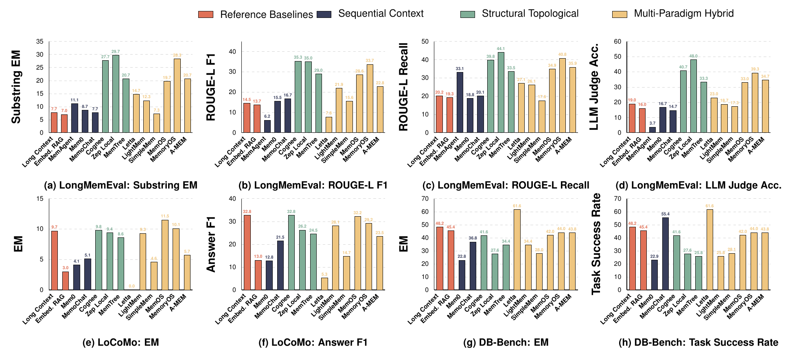

<div align="center">
  <h1>&nbsp;MemoryData</h1>
  <p><b>面向记忆增强 Agent 的统一基准测试套件</b></p>
  <p><i>"一套流水线。四大基准族。二十二种方法预设。一致的执行接口。"</i></p>
</div>

<div align="center">

  [](https://www.python.org/)
  []()
  []()
  []()
  []()

</div>

<br/>

<div align="center">
  <a href="./README.md">English</a> &nbsp;|&nbsp; <b>简体中文</b>
</div>

<br/>

<div align="center">
  <a href="#-简介">简介</a> &nbsp;•&nbsp;
  <a href="#-特性">特性</a> &nbsp;•&nbsp;
  <a href="#-快速开始">快速开始</a> &nbsp;•&nbsp;
  <a href="#-仓库结构">仓库结构</a> &nbsp;•&nbsp;
  <a href="#-方法概览">方法</a> &nbsp;•&nbsp;
  <a href="#-基准测试概览">基准</a> &nbsp;•&nbsp;
  <a href="#-配置约定">配置</a> &nbsp;•&nbsp;
  <a href="#-输出产物">产物</a> &nbsp;•&nbsp;
  <a href="#-常见问题">常见问题</a> &nbsp;•&nbsp;
  <a href="#-引用">引用</a>
</div>

<br/>

<div align="left">
  
  <br/>
  <sub>配套论文中的主要结果：记忆增强 Agent 方法在 <b>LongMemEval</b>、<b>LoCoMo</b> 和 <b>DB-Bench</b> 三个基准上进行对比，指标涵盖 exact-match、ROUGE-L 和 LLM-judge 三类。图中柱状按范式分组——参考基线、序列上下文、结构拓扑、多范式混合。</sub>
</div>

<br/>

> 📣 **参与进来**
> - 📝 **想要阅读清单？** 请见 [Awesome Agent Memory](https://github.com/OpenDataBox/awesome-agent-memory) —— 配套的论文合集。
> - 🚧 **持续更新中** —— 我们正在不断补充新的方法和基准数据集。
> - ⭐ **持续关注** —— Star 仓库追踪进展；欢迎提 [issue](../../issues) 反馈需求；[PR](../../pulls) 同样欢迎！


## ✨ 简介

记忆增强 Agent、结构化记忆架构以及基于检索的基线方法通常各自为战——每篇论文都自带自己的数据加载器、运行时适配器和指标评测工具。结果之间难以横向比较，要在两个方法之间复现同一个评测数值，往往意味着要把两个方法都重新实现一遍。

**MemoryData 正是为填补这一空白而生。** 它是一个面向研究的基准测试套件，将四大基准族（MemoryAgentBench、LoCoMo、LongBench、MemBench）、二十二种方法预设以及共享的运行时统一到一个 `main.py` 启动器之下，使异构的记忆范式能够在一致的执行接口和稳定的产物布局下进行比较。


## 📚 特性

<table>
<tr>

<td width="50%">

**🚀 统一启动器**
`main.py` 是基准执行、产物写入以及可选的运行后评测钩子的唯一入口。只需指定两个 YAML 文件，即可选择任意方法与任意基准。

</td>
<td width="50%">

**🧩 22 种方法预设**
扁平化的 YAML 预设覆盖参考基线、序列上下文、结构拓扑、多范式混合四类架构——每一种都已接入对应的内嵌（vendored）运行时。

</td>
</tr>
<tr>
<td>

**📊 4 大基准族**
MemoryAgentBench、LoCoMo、LongBench 和 MemBench，各自提供完整版配置以及按类别/切片的细分配置，开箱即用。

</td>
<td>

**🗂 一致的分类体系**
方法分组遵循论文中 RQ1 有效性研究的分类方式，因此可以按范式而非文件名来查找预设。

</td>
</tr>
<tr>
<td>

**📦 结构化产物**
每次运行都会在稳定、支持覆盖的 `results/` 根目录下产出结果 JSON、持久化的 Agent 状态以及可选的日志，便于可复现的后处理。

</td>
<td>

**🖥 跨平台**
为 Linux/macOS 与 Windows 分别提供依赖清单，BM25 和长上下文参考路径保留在 `utils/` 下。

</td>
</tr>
</table>


## 🕹 快速开始

**前置条件：** Python 3.11、一个 OpenAI 兼容的模型推理端点，以及放置在 `datasets/` 下的基准数据集。

### 第一步：创建环境

```bash
conda create -n memory-bench python=3.11
conda activate memory-bench
```

| 平台 | 命令 |
| --- | --- |
| Linux / macOS | `pip install -r requirements.txt` |
| Windows | `pip install -r requirements-windows.txt` |

### 第二步：配置模型端点与密钥

大多数预设默认使用 OpenAI 兼容的推理端点。请修改 `config/` 下的 YAML 文件，使 `model`、`base_url`、`embedding_base_url` 及相关 provider 字段与你环境中可用的模型服务相匹配。

| 变量 | 使用方 | 说明 |
| --- | --- | --- |
| `OPENAI_API_KEY` | 大多数预设 | 用于对话与嵌入调用的默认密钥变量 |
| `OPENAI_API_BASE` | MemOS 示例环境 | 使用 MemOS 专属配置时请参考 `methods/MemOS/config/.env.example` |

### 第三步：准备数据集

本仓库**不**随附数据集。请按照加载器的预期将其放置在 `datasets/` 下。

| 基准 | 默认路径 | 格式 | 说明 |
| --- | --- | --- | --- |
| MemoryAgentBench | `datasets/MemoryAgentBench/eval_dataset_collection/` | HuggingFace `save_to_disk` 目录 | 本地副本缺失时回退到 `ai-hyz/MemoryAgentBench` |
| LoCoMo | `datasets/LoCoMo/rq1_4cat_600_dist/locomo_4cat_600_dist.json` | JSON 文件 | 供完整版及按类别的 LoCoMo 预设使用 |
| LongBench | `datasets/longBench_rep150_proportional/datasets` | HuggingFace `save_to_disk` 目录 | 对应按比例采样的子集 |
| MemBench | `datasets/MemBench/MemData/FirstAgent/*.json` | JSON 文件 | `simple`、`noisy`、`knowledge_update`、`highlevel`、`RecMultiSession` |

参考目录结构：

```text
datasets/
├── MemoryAgentBench/
│   └── eval_dataset_collection/          # HuggingFace save_to_disk 目录
├── LoCoMo/
│   └── rq1_4cat_600_dist/
│       └── locomo_4cat_600_dist.json
├── longBench_rep150_proportional/
│   └── datasets/                         # HuggingFace save_to_disk 目录
└── MemBench/
    └── MemData/FirstAgent/               # simple / noisy / knowledge_update / highlevel / RecMultiSession
```

### 第四步：运行实验

命令模板：

```bash
python main.py --agent_config <agent_yaml> --dataset_config <dataset_yaml>
```

代表性运行示例：

| 场景 | Agent 配置 | 数据集配置 | 附加参数 |
| --- | --- | --- | --- |
| MemoryAgentBench 默认运行 | `config/reference_long_context_agent.yaml` | `benchmark/memoryagentbench/Accurate_Retrieval/config/EventQA/Eventqa_full.yaml` | - |
| 小规模冒烟测试 | `config/reference_long_context_agent.yaml` | `benchmark/memoryagentbench/Accurate_Retrieval/config/EventQA/Eventqa_full.yaml` | `--max_test_queries_ablation 1` |
| LoCoMo 评测 | `config/hybrid_simplemem.yaml` | `benchmark/locomo/config/Locomo_qa_4cat_600_dist.yaml` | - |
| LongBench 评测 | `config/reference_embedding_rag.yaml` | `benchmark/longbench/config/LongBench_rep150_proportional.yaml` | - |
| MemBench 评测 | `config/sequential_mem0.yaml` | `benchmark/membench/config/MemBench_simple.yaml` | - |

示例：

```bash
python main.py \
  --agent_config config/reference_long_context_agent.yaml \
  --dataset_config benchmark/memoryagentbench/Accurate_Retrieval/config/EventQA/Eventqa_full.yaml
```


## 🗂 仓库结构

```text
project-root/
├── main.py                        # 统一的实验入口
├── config/                        # 扁平化预设：参考、序列、拓扑、混合
├── benchmark/
│   ├── memoryagentbench/          # MemoryAgentBench 加载器与基准配置
│   ├── locomo/                    # LoCoMo 配置与 JSON 加载器
│   ├── longbench/                 # LongBench 按比例采样子集支持
│   └── membench/                  # MemBench 各切片配置与加载器
├── evaluation/
│   └── longmemeval/               # 保留的 LongMemEval 外挂评测辅助代码
├── methods/                        # 按论文分类组织的方法运行时
│   ├── embedding_rag/              # 稠密检索参考基线
│   ├── memagent/  mem0/  memochat/ # 序列上下文架构
│   ├── cognee/  graph_rag/  hipporag/  memtree/  raptor/  zep/  zep_local/ # 结构拓扑架构
│   └── a_mem/  everos/  letta/  lightmem/  memorag/  memoryos/  self_rag/  simplemem/  MemOS/ # 多范式混合架构
├── utils/                          # 共享运行时工具，包括长上下文与 BM25 参考路径
├── requirements.txt               # Linux/macOS 依赖清单
└── requirements-windows.txt       # Windows 依赖清单
```


## 🧠 方法概览

下表的分类方式遵循配套论文中 RQ1 有效性主表的分组。对于保留在代码仓库中但未在该汇总表中列出的方法，为完整性起见，我们将其归入对应的分类组。

| 分类 | 方法 | 代表性预设 | 运行时入口 | 说明 |
| --- | --- | --- | --- | --- |
| 参考基线 | Long Context | `reference_long_context_agent.yaml` | `utils/agent.py` | 不依赖外部记忆存储、直接利用长上下文作答的基线 |
| 参考基线 | Embedding RAG | `reference_embedding_rag.yaml` | `methods/embedding_rag/embedding_retriever.py` | 稠密检索参考基线 |
| 参考基线 | BM25 RAG | `reference_simple_rag_bm25.yaml` | `utils/agent.py` | 用于对照与冒烟测试的稀疏词法检索基线 |
| 序列上下文架构 | MemAgent | `sequential_memagent.yaml` | `methods/memagent/` | 循环式序列记忆基线 |
| 序列上下文架构 | Mem0 | `sequential_mem0.yaml` | `methods/mem0/source/mem0/` | 带有持久化结构化状态的序列记忆存储 |
| 序列上下文架构 | MemoChat | `sequential_memochat.yaml` | `methods/memochat/memochat_adapter.py` | 带有滚动摘要的序列对话记忆 |
| 结构拓扑架构 | Cognee | `topological_cognee.yaml` | `methods/cognee/source/cognee/` | 图结构记忆运行时 |
| 结构拓扑架构 | Zep Local | `topological_zep_local.yaml` | `methods/zep_local/main.py` | 本地图记忆服务路径 |
| 结构拓扑架构 | MemTree | `topological_memtree.yaml` | `methods/memtree/memtree_adapter.py` | 带溯源信息的树状记忆组织 |
| 结构拓扑架构 | GraphRAG | `topological_graph_rag.yaml` | `methods/graph_rag/graph_rag.py` | 基于结构化图的检索基线 |
| 结构拓扑架构 | HippoRAG | `topological_hippo_rag_v2_openai.yaml` | `methods/hipporag/` | 基于图结构文档组织的检索 |
| 结构拓扑架构 | RAPTOR | `topological_raptor.yaml` | `methods/raptor/raptor.py` | 分层聚类并摘要的检索基线 |
| 结构拓扑架构 | Zep | `topological_zep.yaml` | `methods/zep/zep.py` | 云端图记忆集成 |
| 多范式混合架构 | Letta | `hybrid_letta.yaml` | `utils/agent.py` | 通过内嵌（vendored）的 Letta 源码与本地运行时管理集成 |
| 多范式混合架构 | LightMem | `hybrid_lightmem.yaml` | `methods/lightmem/lightmem_adapter.py` | 分层的记忆构建与检索 |
| 多范式混合架构 | SimpleMem | `hybrid_simplemem.yaml` | `methods/simplemem/simplemem_adapter.py` | 语义、关键词、结构化检索的混合方案 |
| 多范式混合架构 | MemOS | `hybrid_memos.yaml` | `methods/MemOS/source/src/` | 内嵌的记忆操作系统运行时 |
| 多范式混合架构 | MemoryOS | `hybrid_memoryos.yaml` | `methods/memoryos/memoryos_adapter.py` | 针对保留的 MemoryOS 实现的本地运行时封装 |
| 多范式混合架构 | A-MEM | `hybrid_a_mem.yaml` | `methods/a_mem/a_mem_adapter.py` | 带溯源追踪的混合记忆写入与检索 |
| 多范式混合架构 | EverOS | `hybrid_everos.yaml` | `methods/everos/everos_adapter.py` | 面向搜索的外部记忆运行时 |
| 多范式混合架构 | Self-RAG | `hybrid_self_rag.yaml` | `methods/self_rag/self_rag.py` | 当前代码版本中保留的检索增强生成（RAG）基线 |
| 多范式混合架构 | MemoRAG | `hybrid_memo_rag.yaml` | `methods/memorag/` | 面向长上下文、依赖缓存的检索流水线 |


## 📊 基准测试概览

| 基准族 | 配置文件 | 任务焦点 | 预期输入格式 |
| --- | --- | --- | --- |
| MemoryAgentBench / 精确检索 | `benchmark/memoryagentbench/Accurate_Retrieval/config/EventQA/Eventqa_full.yaml`<br>`benchmark/memoryagentbench/Accurate_Retrieval/config/LongMemEval/Longmemeval_s.yaml` | 在精选的 MemoryAgentBench 切分下进行问答与长时记忆检索 | 位于 `datasets/MemoryAgentBench/eval_dataset_collection/` 的 HuggingFace `save_to_disk` 副本，或回退到 `ai-hyz/MemoryAgentBench` |
| MemoryAgentBench / 冲突消解 | `benchmark/memoryagentbench/Conflict_Resolution/config/Factconsolidation_mh_6k.yaml` | 在长交互历史中消解相互冲突的事实 | 与上文相同的 MemoryAgentBench 加载路径 |
| MemoryAgentBench / 测试时学习 | `benchmark/memoryagentbench/Test_Time_Learning/config/ICL/ICL_banking77.yaml` | 上下文内适配与标签空间记忆 | 与上文相同的 MemoryAgentBench 加载路径 |
| LoCoMo | `benchmark/locomo/config/Locomo_qa_4cat_600_dist.yaml`<br>`benchmark/locomo/config/Locomo_qa_4cat_600_dist_cat1_multi_hop.yaml`<br>`benchmark/locomo/config/Locomo_qa_4cat_600_dist_cat2_temporal.yaml`<br>`benchmark/locomo/config/Locomo_qa_4cat_600_dist_cat3_open_domain.yaml`<br>`benchmark/locomo/config/Locomo_qa_4cat_600_dist_cat4_single_hop.yaml` | 在长对话上进行对话式问答，提供完整版与按类别的子集 | JSON 文件，通常为 `datasets/LoCoMo/rq1_4cat_600_dist/locomo_4cat_600_dist.json` |
| LongBench | `benchmark/longbench/config/LongBench_rep150_proportional.yaml` | 在当前预设所使用的按比例采样子集上进行长上下文多选题推理 | HuggingFace `save_to_disk` 目录，通常为 `datasets/longBench_rep150_proportional/datasets` |
| MemBench | `benchmark/membench/config/MemBench_simple.yaml`<br>`benchmark/membench/config/MemBench_noisy.yaml`<br>`benchmark/membench/config/MemBench_knowledge_update.yaml`<br>`benchmark/membench/config/MemBench_highlevel.yaml`<br>`benchmark/membench/config/MemBench_RecMultiSession.yaml` | 记忆压力测试，覆盖简单回忆、噪声、知识更新、高层次推理以及多会话推荐 | 位于 `datasets/MemBench/MemData/FirstAgent/` 下的各切片 JSON 文件 |


## ⚙️ 配置约定

| 字段 | 含义 |
| --- | --- |
| `provider` | 对话模型后端类型，默认预设中通常为 `openai_compatible` |
| `base_url` | 对话模型服务的端点 |
| `embedding_provider` | 当方法使用向量检索时，生成嵌入所用的后端类型 |
| `embedding_base_url` | 嵌入模型服务的端点 |
| `*_api_key_env` | 运行时用于解析 API 密钥的环境变量名 |
| `retrieve_num` | 启用检索的方法所使用的检索深度或 top-`k` |


## 📦 输出产物

| 产物类型 | 默认位置 | 说明 |
| --- | --- | --- |
| 结果 JSON | `results/outputs/<model>/<dataset>/<name_tag>_results.json` | 主要评测输出，包含指标、查询级记录以及汇总字段 |
| Agent 状态 | `results/agents/` | 持久化的 Agent 记忆、检索缓存与方法特定的状态 |
| 产物根目录覆盖 | `--artifact_root /path/to/artifacts` | 重设外层产物根目录，但内部布局保持不变 |

产物布局：

```text
results/
├── outputs/                                     # 按模型与数据集分组的评测输出
│   └── <model>/                                 # 模型或预设专属的输出命名空间
│       └── <dataset>/                           # 基准专属的输出命名空间
│           └── <name_tag>_results.json          # 包含指标与记录的主结果文件
├── agents/                                      # 持久化的 Agent 状态与方法侧缓存
│   └── <model_or_method>/                       # 运行时专属的存储命名空间
└── logs/                                        # 由本次运行开启的可选执行日志
```

示例：

```bash
python main.py \
  --agent_config config/reference_long_context_agent.yaml \
  --dataset_config benchmark/memoryagentbench/Accurate_Retrieval/config/EventQA/Eventqa_full.yaml \
  --artifact_root /path/to/artifacts
```

当指定 `--artifact_root` 时，流水线会在新的根目录下保持同样的 `results/outputs`、`results/agents`、`results/logs` 内部组织方式，便于隔离多次重复实验批次，同时保持下游解析与后处理逻辑不变。


## 🤔 常见问题

<details>
<summary><b>数据集是否随仓库一起提供？</b></summary>
<br/>
不提供。本仓库不分发数据集。请按照<a href="#-快速开始">快速开始</a>一节中的路径将其放置在 <code>datasets/</code> 下。当本地缺失时，MemoryAgentBench 还会回退到 <code>ai-hyz/MemoryAgentBench</code> 这个 HuggingFace 镜像。
</details>

<details>
<summary><b>不同运行之间是否需要重新构建或重新安装？</b></summary>
<br/>
不需要。MemoryData 是一个通过 <code>python main.py</code> 启动的纯 Python 流水线。切换方法或基准，只需将 <code>--agent_config</code> 和 <code>--dataset_config</code> 指向不同的 YAML 文件即可。
</details>

<details>
<summary><b>支持哪些模型提供商？</b></summary>
<br/>
默认预设面向 OpenAI 兼容的对话与嵌入端点，因此任何提供该接口的提供商均可使用。请修改所选预设中的 <code>base_url</code>、<code>embedding_base_url</code> 以及相关的 <code>*_api_key_env</code> 字段以匹配你的服务。
</details>

<details>
<summary><b>如何强制进行一次干净的重新运行？</b></summary>
<br/>
传入 <code>--force</code> 可在运行前删除已保存的结果、重建本地 agent 状态并重置受支持的外部持久化。若想在恢复运行时重试之前失败的查询而不是跳过它们，可使用 <code>--retry_failed_queries</code>。
</details>


## 📒 引用

如果该基准套件对你的研究有帮助，请引用：

```bibtex
@article{zhoumemorydata2026,
    title={Are We Ready For An Agent-Native Memory System?},
    author={Wei Zhou and Xuanhe Zhou and Shaokun Han and Hongming Xu and Guoliang Li and Zhiyu Li and Feiyu Xiong and Fan Wu},
    year={2026},
    journal={arXiv preprint arXiv:2606.24775},
    url={https://arxiv.org/abs/2606.24775}
}
```
